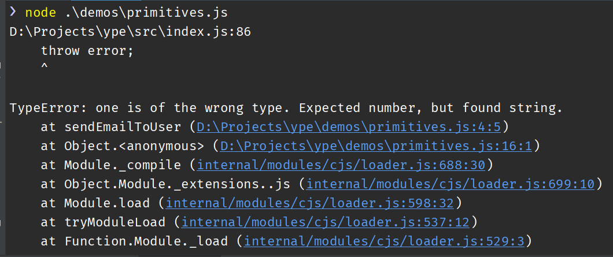

# ype

**This project is still in its experimental stages.**

TypeScript is cool, but it only gives you static type checking. Type errors can still slip into your code. Ype is designed to give you runtime type assertions in JavaScript, with **minimal performance overhead** and **helpful error messages**.

You can use Ype anywhere you need to, but the major use case Ype was built for is in function arguments.

## Why TypeScript (or any other static typechecker) isn't enough
TypeScript statically checks your code for possible type errors. But it cannot stop all errors, especially if you type wrongly or weakly (which happens more than we like to admit).
 
Look at this piece of valid TypeScript code. It gets a value from the user (form submission) and does something with it.

```typescript
function performAction(action: "UPDATE" | "DELETE") {
    if (action == "UPDATE") {
        updateThing();
    } else { // Then action must be "DELETE"
        deleteThing();
    }
}

const action: "UPDATE" | "DELETE" = req.body.action;
performAction(action);
```

But you have no way of stopping the user from passing in a different value for `action`, without added frontend validation not covered by TypeScript. This can lead to bugs in your code (`deleteThing()` will be called unintentionally). With ype, you can prevent such with runtime assertions. 

## Examples

```js
const y = require("ype");

function sendEmailToUser(message, userId, replyTo) {
    y(
        [message, String],
        [userId, Number],
        [replyTo, String],
    );
   
    // Continue with the rest of your code. 
    // At this point, `userId` will definitely be a Number, 
    // so if you do userId + 1, you won't see nonsense like "undefined1"
}

sendEmailToUser("Hi there!", 1, "help@domain.com"); // This is OK
sendEmailToUser("Hi there!", "one", "help@domain.com"); // This will throw, because "one" is not a number
```



You can have nullable types, union types and more:

```js
const y = require("ype");

function sendEmailToUsers(message, userIds, replyTo = null) {
    y(
        [message, String],
        [userIds, Number, [Number]], // a number of array of numbers
        [replyTo, String, null], // nullable type
    );
}

sendEmailToUser("Hi there!", 1, "help@domain.com"); // This is OK
sendEmailToUser("Hi there!", [1, 3], "help@domain.com"); // This is OK
sendEmailToUser("Hi there!", [1, 3]); // This is OK
sendEmailToUser("Hi there!", ["one"], "help@domain.com"); // This will throw
```

More:
```js
// Going further
function doSomething(var1, var2, var3, var4, var5, var6) {
    types(
        [var1, y.union(String, [String])],  // union types
        [var1, String, [String]],  // also union types
        [var1, String, null],  // nullable types
        [var2, y.values("this", "that")],  // same as "this" | "that" and enums in TypeScript
        [var3, y.range(2, 7)], // Range. Only valid for Number and subsets
        [var5, y.shape({a: [String], b: [Number, null], c: [[String], String], d: y.only(1, 3)})], // structural typing
        [var6, y.instance(MyClass)], // instance of a class
    );
}

// define and reuse types
const UserType = y.shape({
  id: [Number],
  name: [String],
});


const PinCodeType = y.makeCustomType({
    name: `a PIN code (4-digit string)`,
    inherits: [String],
    // The check should return true if the value is valid.
    // Otherwise it returns type information about the value.
    check(value, valueType) {
        // At this point, value is definitely a string
        // (because of our `inherits` specifier earlier
        if (value.length !== 4) {
            return {type: valueType, name: `'${value} (${value.length} digits)`}
        }

        for (let char of value) {
            if (isNaN(parseInt(char, 10))) {
                return {type: valueType, name: `a non-digit '${char}'`}
            }
        }

        return true;
    }
});

// then use:
function savePin(user, pinCode) {
  y([user, UserType], [pinCode, PinCodeType]);
  
  // save the PIN
}

// Will throw error: 'hahaha' is the wrong type. 
// Expected a PIN code (4-digit string), but got 'hahaha' (6 digits).
savePin({ id: "dy53hd", name: "Joe", }, "hahaha");

// Will throw error: 8 is the wrong type. 
// Expected a PIN code (4-digit string), but got number.
savePin({ id: "dy53hd", name: "Joe", }, 6);

// Will throw error: '6d44' is of the wrong type. 
// Expected a PIN code (4-digit string), but got a non-digit 'd'
savePin({ id: "dy53hd", name: "Joe", }, "6d44");

```